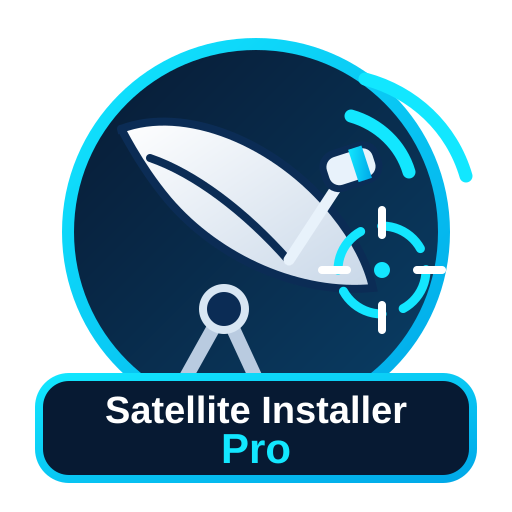

  

# Satellite Installer Pro

Repository Home Assistant per un add-on dedicato alla **progettazione, configurazione e puntamento professionale di impianti satellitari**.

## Funzioni principali
- Calcolo di azimut, elevazione e skew LNB dalla località.
- Ricerca città con compilazione automatica delle coordinate.
- Più satelliti selezionabili sullo stesso impianto.
- Più transponder di riferimento per satellite, inclusi riferimenti tivùsat su Hotbird.
- Configurazione guidata per **Amiko X-Finder 3**.
- LNB Universal, Single, Twin, Quad, Octo, Quattro, Wideband.
- Profili Wideband con LO personalizzata e controllo della IF compatibile con lo strumento.
- SCR / Unicable EN50494 e supporto guidato JESS / dCSS EN50607.
- Schema componenti e cablaggio.
- Vista multifeed **frontale e posteriore**.
- Distinzione chiara tra **LNB centrale – satellite puntato direttamente** e **LNB laterale – ricezione offset**.
- Calcolo indicativo delle distanze LNB centro-centro in millimetri usando diametro parabola e rapporto F/D.
- Interfaccia responsive per Home Assistant Ingress, telefono, tablet e PC.

## Installazione
Aggiungi questa repository allo store degli add-on di Home Assistant:

`https://github.com/EdisonACDC/-home-assistant-satellite-installer`

## Stato
Versione corrente: **0.7.2**

Il progetto è in sviluppo continuo. I dati di transponder e canali possono cambiare nel tempo e vanno verificati prima dell'uso professionale sul campo.
